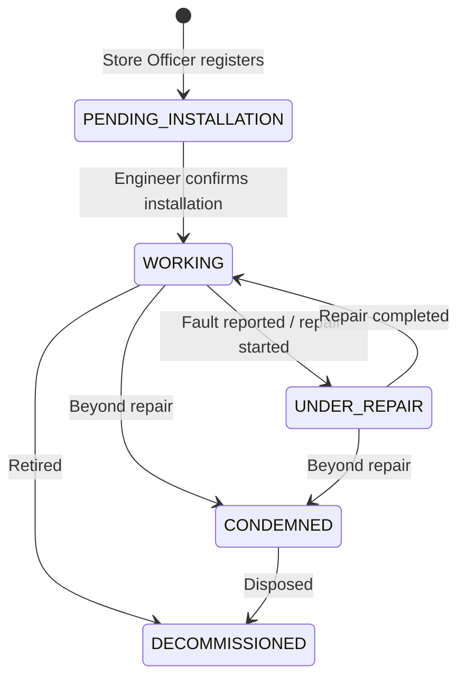

# Hospital Equipment Inventory Management System — Backend

A production-grade **NestJS + MongoDB (Mongoose)** backend for tracking hospital
equipment from receiving through installation, maintenance, and end-of-life —
with role-based access control, department scoping, an equipment lifecycle
state machine, notifications, dashboards, and exportable reports.

## Tech stack

- **NestJS 11** / TypeScript, modular architecture (`src/modules/<domain>`)
- **MongoDB** via **Mongoose** (schemas, indexes, soft deletes, aggregation pipelines)
- **Auth:** JWT access + refresh tokens (Passport strategies), bcrypt password hashing,
  SHA-256 refresh-token hashing, RBAC (`@Roles`) + department scoping
- **Validation:** `class-validator` / `class-transformer` DTOs, global `ValidationPipe`
- **Docs:** Swagger UI at `/api/docs`
- **Files:** swappable storage provider (`local` disk implemented, `s3` stubbed)
- **Notifications:** `@nestjs/event-emitter` + `@nestjs/schedule` cron jobs
- **Reports:** Excel (`exceljs`) and PDF (`pdfkit`) exports
- **Logging:** `nestjs-pino` structured JSON logs with request correlation IDs
- **Security:** Helmet, CORS, `@nestjs/throttler` rate limiting

## Project layout

```
src/
  main.ts, app.module.ts
  config/            typed config factory + Joi env validation
  database/          MongooseModule wiring
  common/             cross-cutting: base schema, guards, decorators, filters, interceptors
  modules/
    auth/            login, refresh, logout
    users/           user CRUD, profile, password management
    departments/     department master data + seeding
    files/           storage provider abstraction (no HTTP surface)
    equipment/       equipment CRUD, uploads, QR codes
    receiving/       intake + lifecycle state machine + history
    maintenance/     preventive/corrective/calibration records
    notifications/   in-app notifications, cron checks, event listeners
    dashboard/       aggregated KPI summary
    reports/         Excel/PDF exports
  seed/              default admin + default departments, runs on bootstrap
test/                e2e specs (auth, equipment, maintenance, app)
```

Each module README under `src/modules/<name>/README.md` documents its endpoints,
schema, and sample requests in detail — see the links below.

## Getting started

```bash
npm install
cp .env.example .env   # then fill in real secrets
npm run start:dev
```

The app seeds a **default administrator** and the **19 standard hospital
departments** on first boot (see [Seed data](#seed-data) below). Sign in with
those credentials, then create real users/departments and change the admin
password immediately.

Swagger UI: `http://localhost:3000/api/docs`
Health check: `GET /health` (public)

## Environment variables

See `.env.example` for the full list; validated at boot via
`src/config/validation.schema.ts` (Joi). Key groups:

| Group | Variables |
|-------|-----------|
| App | `NODE_ENV`, `PORT`, `CORS_ORIGIN` |
| Database | `MONGODB_URI` |
| JWT | `JWT_ACCESS_SECRET`, `JWT_ACCESS_EXPIRES_IN`, `JWT_REFRESH_SECRET`, `JWT_REFRESH_EXPIRES_IN` |
| Storage | `STORAGE_DRIVER` (`local`\|`s3`), `UPLOAD_ROOT_DIR`, `UPLOAD_MAX_FILE_SIZE_MB`, `APP_BASE_URL`, `AWS_S3_*` (only used when `STORAGE_DRIVER=s3`) |
| Seed | `DEFAULT_ADMIN_USERNAME`, `DEFAULT_ADMIN_EMAIL`, `DEFAULT_ADMIN_PASSWORD` |
| Maintenance cadence | `PM_DEFAULT_FREQUENCY_DAYS`, `CALIBRATION_DEFAULT_FREQUENCY_DAYS`, `PM_DUE_LEAD_DAYS`, `WARRANTY_EXPIRING_LEAD_DAYS` |
| Throttling | `THROTTLE_TTL_SECONDS`, `THROTTLE_LIMIT` |

`JWT_ACCESS_SECRET` / `JWT_REFRESH_SECRET` must each be at least 16 characters
and **must differ** in production.

## Running the app

```bash
npm run start          # production-style start, no watch
npm run start:dev       # watch mode
npm run start:prod       # runs the compiled dist/main.js
```

## Running tests

```bash
npm run test           # unit tests (Jest, per-service .spec.ts files)
npm run test:e2e        # e2e tests (mongodb-memory-server + supertest)
npm run test:cov         # unit test coverage report
```

e2e tests spin up an in-memory MongoDB instance per suite (no external Mongo
required) via `mongodb-memory-server`; see `test/utils/e2e-setup.ts`.

## Core conventions

- **Response envelope** — every successful response is wrapped as
  `{ data, meta }` by the global `ResponseInterceptor`. Paginated list
  endpoints populate `meta` with `{ page, limit, totalItems, totalPages }`;
  everything else gets `meta: {}`. Report file downloads are the one
  exception (they stream a raw file, no envelope).
- **Error shape** — the global `HttpExceptionFilter` normalizes every thrown
  error to `{ statusCode, message, error, timestamp, path }`.
- **Pagination/sorting/search** — list endpoints accept `page`, `limit`
  (max 100), `sort` (e.g. `-createdAt` for descending), and often a
  module-specific `search`/filter set — see each module's README.
- **Auth** — every route requires a Bearer access token unless marked
  `@Public()`. `@Roles(...)` restricts a route to specific roles; omitting it
  means "any authenticated role."
- **Department scoping** — `ADMINISTRATOR` and `STORE_OFFICER` see all
  departments; `BIOMEDICAL_ENGINEER` and `DEPARTMENT_USER` are transparently
  scoped to their assigned `departments` on list/aggregate queries.
- **Soft delete** — domain collections use `isDeleted`/`deletedAt` instead of
  hard deletes; a Mongoose plugin excludes soft-deleted docs from all
  `find`-family queries and aggregations automatically.
- **Audit fields** — `createdBy`/`updatedBy` are stamped automatically from
  the authenticated user by `AuditInterceptor`.

## Roles

| Role | Description |
|------|-------------|
| `ADMINISTRATOR` | Full access to every module, including user/department management and reports |
| `STORE_OFFICER` | Registers incoming equipment, manages equipment records |
| `BIOMEDICAL_ENGINEER` | Confirms installations, manages equipment status/maintenance for their department(s) |
| `DEPARTMENT_USER` | Read-only visibility into their department's equipment/maintenance |

See each module's README for the exact role matrix per endpoint.

## Seed data

On every boot, `SeedService`:

1. Ensures all 19 default departments exist (Theatre, ICU, HDU, Newborn Unit,
   Maternity/Labour, Laboratory, Radiology, Dental, CSSD, Renal Unit,
   Physiotherapy, Laundry, Kitchen, Mortuary, Wards, OPD, Eye Clinic, ENT,
   Pharmacy) — see `src/modules/departments/departments.constants.ts`.
2. Creates a default `ADMINISTRATOR` (from `DEFAULT_ADMIN_*` env vars) if no
   administrator account exists yet.

## Equipment lifecycle



Every transition is recorded in `EquipmentHistory` (see the
[`receiving` module README](src/modules/receiving/README.md)) and illegal
transitions are rejected with `400 Bad Request`.

## Module documentation

| Module | Summary |
|--------|---------|
| [`auth`](src/modules/auth/README.md) | Login, token refresh/rotation, logout |
| [`users`](src/modules/users/README.md) | User CRUD, profile, password management |
| [`departments`](src/modules/departments/README.md) | Department master data |
| [`files`](src/modules/files/README.md) | Storage provider abstraction (local/S3) |
| [`equipment`](src/modules/equipment/README.md) | Equipment CRUD, uploads, QR codes |
| [`receiving`](src/modules/receiving/README.md) | Intake, lifecycle state machine, history |
| [`maintenance`](src/modules/maintenance/README.md) | PM/corrective/calibration records |
| [`notifications`](src/modules/notifications/README.md) | In-app notifications, cron checks |
| [`dashboard`](src/modules/dashboard/README.md) | Aggregated KPI summary |
| [`reports`](src/modules/reports/README.md) | Excel/PDF exports |

## License

UNLICENSED — internal project.
