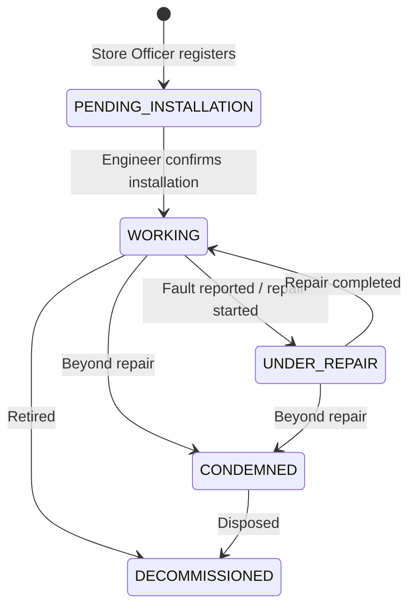

# Receiving module

Equipment intake and lifecycle management: register incoming equipment,
confirm installation, transition operational status, and browse the audit
trail of every transition.

## State machine



Enforced allowed transitions:

```
PENDING_INSTALLATION → WORKING
WORKING              → UNDER_REPAIR | CONDEMNED | DECOMMISSIONED
UNDER_REPAIR         → WORKING | CONDEMNED
CONDEMNED            → DECOMMISSIONED
DECOMMISSIONED       → (terminal — no further transitions)
```

Any other transition is rejected with `400 Bad Request`. `PENDING_INSTALLATION`
equipment is excluded from the "active department inventory" view
(`GET /equipment/department/:departmentId`) until installation is confirmed.

## Schema (`EquipmentHistory`)

One document per transition (not embedded on `Equipment`, so history can be
queried/paginated independently of document size):

| Field | Type | Notes |
|-------|------|-------|
| `equipment` | ObjectId → `Equipment` | indexed |
| `fromStatus` | `EquipmentStatus \| null` | `null` for the initial registration |
| `toStatus` | `EquipmentStatus` | required |
| `changedBy` | ObjectId → `User` | required |
| `changedAt` | Date | defaults to now |
| `note` | string | optional |

## Endpoints

| Method | Path | Roles | Body |
|--------|------|-------|------|
| `POST` | `/receiving/register` | `ADMINISTRATOR`, `STORE_OFFICER` | `RegisterEquipmentDto` (same shape as `CreateEquipmentDto`, minus `status` — always forced to `PENDING_INSTALLATION`) |
| `PATCH` | `/receiving/:equipmentId/confirm-installation` | `ADMINISTRATOR`, `BIOMEDICAL_ENGINEER` | `{ installationDate?, note? }` |
| `PATCH` | `/receiving/:equipmentId/status` | `ADMINISTRATOR`, `BIOMEDICAL_ENGINEER` | `{ toStatus, note? }` |
| `GET` | `/receiving/:equipmentId/history` | any authenticated | `page`, `limit`, `sort` (paginated, most recent first) |

## Sample requests

**Register incoming equipment**

```http
POST /receiving/register
Authorization: Bearer <storeOfficerAccessToken>
Content-Type: application/json

{
  "name": "Infusion Pump",
  "category": "Therapeutic",
  "manufacturer": "B. Braun",
  "serialNumber": "SN-99887766",
  "department": "665f1b2c8a1e2f0012345678"
}
```

```json
{ "data": { "id": "...", "status": "PENDING_INSTALLATION", "...": "..." }, "meta": {} }
```

**Confirm installation** (sets `status: WORKING`, `installationDate`, `installedBy`)

```http
PATCH /receiving/665f1b2c8a1e2f001234567c/confirm-installation
Authorization: Bearer <engineerAccessToken>
Content-Type: application/json

{ "installationDate": "2026-07-10", "note": "Installed and tested in ICU bay 3" }
```

**Change status** (e.g. send to repair)

```http
PATCH /receiving/665f1b2c8a1e2f001234567c/status
Authorization: Bearer <engineerAccessToken>
Content-Type: application/json

{ "toStatus": "UNDER_REPAIR", "note": "Alarm module malfunctioning" }
```

An illegal transition (e.g. `PENDING_INSTALLATION → CONDEMNED`) returns:

```json
{
  "statusCode": 400,
  "message": "Cannot transition equipment from PENDING_INSTALLATION to CONDEMNED",
  "error": "Bad Request",
  "timestamp": "2026-07-10T20:33:00.000Z",
  "path": "/receiving/665f1b2c8a1e2f001234567c/status"
}
```

**Get history**

```http
GET /receiving/665f1b2c8a1e2f001234567c/history?page=1&limit=20
Authorization: Bearer <accessToken>
```

```json
{
  "data": [
    { "fromStatus": "PENDING_INSTALLATION", "toStatus": "WORKING", "changedBy": { "username": "engineer.jane", "fullName": "Jane Doe" }, "changedAt": "..." },
    { "fromStatus": null, "toStatus": "PENDING_INSTALLATION", "changedBy": { "...": "..." }, "changedAt": "..." }
  ],
  "meta": { "page": 1, "limit": 20, "totalItems": 2, "totalPages": 1 }
}
```

## Events emitted (`@nestjs/event-emitter`)

| Event | Payload | Emitted when |
|-------|---------|--------------|
| `equipment.received` | `EquipmentReceivedEvent` | After `register()` |
| `equipment.installed` | `EquipmentInstalledEvent` | After `confirmInstallation()` |
| `equipment.status-changed` | `EquipmentStatusChangedEvent` | After `changeStatus()` |

The [`notifications`](../notifications/README.md) module listens for
`equipment.received` and `equipment.installed` to fan out in-app alerts.
